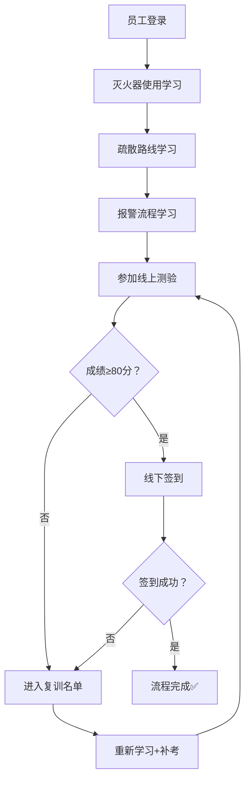
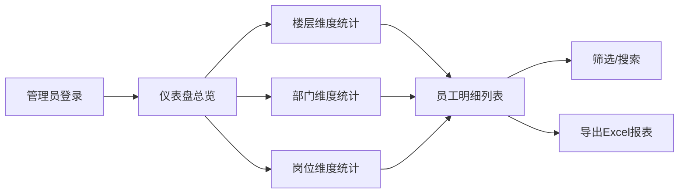

## 1. 产品概述

消防安全演练考试系统是面向企业的安全培训管理平台，帮助企业组织员工完成灭火器使用、疏散路线和报警流程的学习与考核。系统通过线上学习、测验、线下签到相结合的方式，确保员工掌握消防安全知识，未通过考核者自动进入复训名单，管理端可多维度统计完成情况。

- 目标用户：企业员工（学习端）、安全管理员（管理端）
- 核心价值：规范消防安全培训流程，提升培训效率与可追溯性

## 2. 核心功能

### 2.1 用户角色
| 角色 | 登录方式 | 核心权限 |
|------|----------|----------|
| 员工用户 | 工号+密码登录 | 学习课程、参加线上测验、线下签到、查看个人成绩 |
| 安全管理员 | 管理员账号登录 | 发布课程、管理题库、查看统计报表、导出数据、管理复训名单 |

### 2.2 功能模块
1. **员工端首页**：学习进度总览、待办任务、快速入口
2. **学习中心**：灭火器使用课程、疏散路线课程、报警流程课程
3. **线上测验**：随机组卷、限时答题、自动判分、成绩展示
4. **线下签到**：签到码验证、位置确认、签到记录
5. **个人中心**：学习记录、成绩历史、复训状态
6. **管理端仪表盘**：总体完成率、楼层/部门/岗位统计、待复训人数
7. **员工管理**：员工信息、楼层分配、部门管理、岗位设置
8. **统计报表**：多维度筛选、数据可视化、导出Excel

### 2.3 页面详情
| 页面名称 | 模块名称 | 功能描述 |
|-----------|-------------|---------------------|
| 员工端首页 | 进度卡片 | 展示三门课程的学习完成状态、测验通过状态、签到状态 |
| 员工端首页 | 待办提醒 | 醒目显示未完成的任务项及截止时间 |
| 学习中心-灭火器使用 | 视频播放区 | 灭火器类型介绍、使用步骤演示视频 |
| 学习中心-灭火器使用 | 图文说明 | PPT式翻页讲解，关键知识点标注 |
| 学习中心-疏散路线 | 楼层平面图 | 可交互的疏散路线图，标注安全出口、集合点 |
| 学习中心-疏散路线 | 注意事项 | 逃生要点、禁止行为说明 |
| 学习中心-报警流程 | 流程图 | 发现火情→确认→报警→疏散的完整流程 |
| 学习中心-报警流程 | 模拟报警 | 模拟拨打119对话练习 |
| 线上测验 | 答题界面 | 单选/多选/判断题型，进度条、倒计时 |
| 线上测验 | 成绩结果 | 分数展示、错题回顾、通过/未通过判定 |
| 线下签到 | 签到页 | 输入签到码/扫码签到、GPS位置校验 |
| 管理端仪表盘 | 统计卡片 | 总人数、已学习、已通过、已签到、待复训 |
| 管理端仪表盘 | 维度图表 | 按楼层/部门/岗位的柱状图、饼图展示 |
| 管理端-员工管理 | 员工列表 | 筛选、搜索、批量导入、状态管理 |
| 管理端-统计报表 | 报表页 | 多条件筛选、数据表格、一键导出 |

## 3. 核心流程

### 3.1 员工学习考核流程
员工登录系统后，依次完成三门课程的学习（灭火器使用→疏散路线→报警流程）。每门课程学习完成后标记为已学习，全部学习完成后解锁线上测验入口。测验及格（默认80分）后获得线下签到资格；未及格则直接进入复训名单。线下签到成功后，整个流程完成；若签到失败或未签到，也进入复训名单。复训用户需重新学习并参加补考。

### 3.2 管理员统计流程
管理员登录后进入仪表盘，可查看整体完成情况概览。切换楼层/部门/岗位维度进行细分统计，深入查看特定群体的完成率、通过率、复训率。点击具体数字可钻取到员工明细列表，支持导出数据报表用于汇报或存档。

## 4. 用户界面设计

### 4.1 设计风格
- **主色调**：消防红（#E63946）作为品牌主色，搭配深海蓝（#1D3557）作为辅助色，体现消防安全主题的严肃性与专业性
- **强调色**：警示黄（#F4A261）用于提醒和待办事项，成功绿（#2A9D8F）用于完成状态
- **按钮风格**：圆角矩形按钮（8px圆角），主按钮采用消防红渐变，悬停有微放大动效
- **字体方案**：标题使用"Noto Sans SC Bold"，正文使用"Noto Sans SC Regular"，数字使用等宽字体增强数据感
- **布局风格**：卡片式布局，清晰的模块边界，足够的留白呼吸感
- **图标风格**：线性填充结合风格，使用消防主题图标（灭火器、消火栓、安全出口、警报铃等）

### 4.2 页面设计总览
| 页面名称 | 模块名称 | UI元素 |
|-----------|-------------|-------------|
| 登录页 | 登录表单 | 消防主题背景、左侧插画右侧表单双栏布局、工号密码输入框、角色切换Tab |
| 员工端首页 | 进度总览 | 大数字统计卡、环形进度图、三色状态标签（绿/黄/红） |
| 学习中心 | 课程卡片 | 课程封面图、学习时长、完成进度条、开始/继续学习按钮 |
| 课程详情页 | 内容区 | 视频播放器、步骤时间轴、知识点高亮卡片、上一页/下一页导航 |
| 疏散路线页 | 交互图 | SVG楼层平面图、可点击热区、路线动画演示、图例说明 |
| 线上测验 | 答题界面 | 题目序号导航栏、题干卡片、选项单选按钮、倒计时进度环、提交确认弹窗 |
| 成绩结果页 | 结果展示 | 大号分数、通过/未通过徽章、错题列表、参考答案对比 |
| 线下签到 | 签到区 | 大号签到码输入框、扫码区域、位置状态指示、签到成功动效 |
| 管理端仪表盘 | 数据图表 | 顶部KPI卡片组、柱状图（对比各楼层/部门）、饼图（完成状态分布）、复训人员滚动列表 |
| 员工管理 | 数据表格 | 多条件筛选栏、分页表格、操作按钮组、批量操作工具栏 |
| 统计报表 | 报表页 | 时间范围选择器、维度切换器、数据透视表、导出按钮 |

### 4.3 响应式
- 采用桌面端优先设计，员工端核心使用场景为企业内部PC
- 管理端适配宽屏显示器（1920px），数据表格支持横向滚动
- 员工端页面平板自适应（≥768px），签到功能支持移动端扫码签到
- 触控交互优化：按钮最小44×44px，大输入框便于触屏操作

### 4.4 微交互与动画
- 页面加载：卡片从下往上渐入，带200ms错峰延迟
- 学习进度：进度条填充动画，数字滚动计数
- 签到成功：绿色对勾SVG描边动画，配合成功提示滑入
- 数据图表：柱状图从0开始生长动画，饼图扇形展开动画
- 按钮交互：悬停微放大1.03倍+投影加深，点击回弹效果
