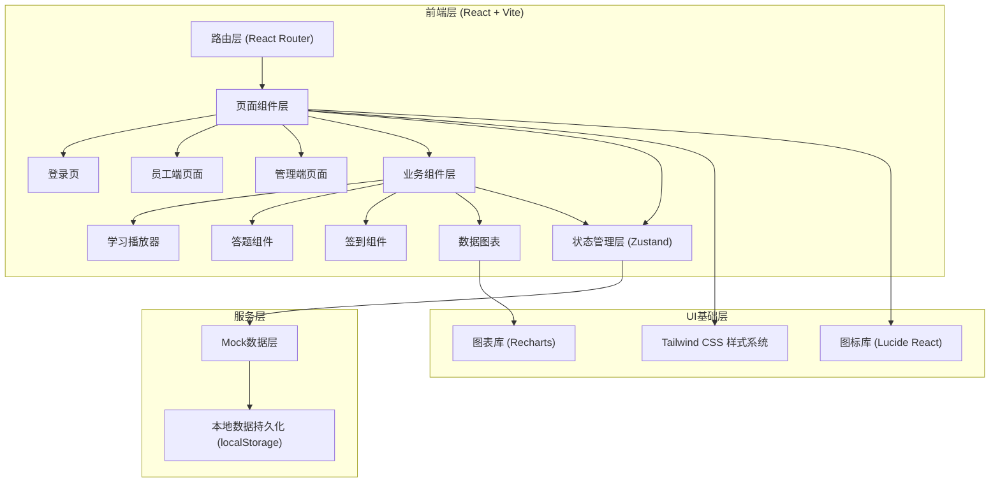
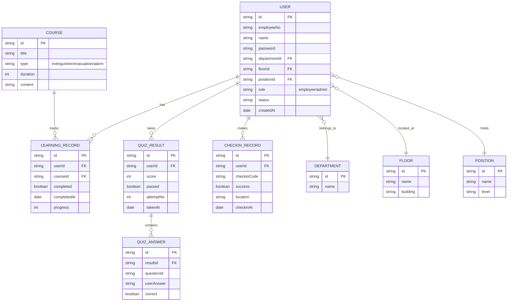

## 1. 架构设计



## 2. 技术说明

- **前端框架**：React 18 + TypeScript，提供类型安全与组件化开发
- **构建工具**：Vite 5，快速开发构建与热更新
- **样式方案**：Tailwind CSS 3，原子化CSS快速构建UI
- **路由管理**：React Router DOM 6，单页应用路由控制
- **状态管理**：Zustand 4，轻量级状态管理，管理用户状态与学习数据
- **图表可视化**：Recharts 2，React原生图表库，构建统计图表
- **图标系统**：Lucide React，一致性线性图标
- **UI组件**：Headless UI，无样式组件库配合Tailwind
- **数据持久化**：localStorage模拟后端存储，保存用户数据与学习进度
- **Mock数据**：内置完整的模拟数据（员工、题库、课程、签到码等）

## 3. 路由定义

| 路由路径 | 页面用途 | 权限角色 |
|----------|----------|----------|
| `/login` | 登录页，工号/管理员账号登录 | 公开 |
| `/employee` | 员工端首页，学习进度总览 | 员工 |
| `/employee/learning` | 学习中心，课程列表 | 员工 |
| `/employee/learning/fire-extinguisher` | 灭火器使用课程详情 | 员工 |
| `/employee/learning/evacuation` | 疏散路线课程详情 | 员工 |
| `/employee/learning/alarm` | 报警流程课程详情 | 员工 |
| `/employee/quiz` | 线上测验入口与答题页 | 员工 |
| `/employee/quiz/result` | 测验成绩结果页 | 员工 |
| `/employee/checkin` | 线下签到页 | 员工（测验通过后解锁） |
| `/employee/profile` | 个人中心，学习记录 | 员工 |
| `/admin` | 管理端仪表盘，统计总览 | 管理员 |
| `/admin/employees` | 员工管理，员工列表与信息 | 管理员 |
| `/admin/reports` | 统计报表，多维度分析 | 管理员 |
| `/admin/retraining` | 复训名单管理 | 管理员 |

## 4. 数据模型

### 4.1 实体关系图



### 4.2 核心数据类型定义

```typescript
// 用户/员工
interface User {
  id: string;
  employeeNo: string;
  name: string;
  password: string;
  departmentId: string;
  floorId: string;
  positionId: string;
  role: 'employee' | 'admin';
  status: 'normal' | 'retraining';
  createdAt: string;
}

// 部门/楼层/岗位
interface Department { id: string; name: string; }
interface Floor { id: string; name: string; building: string; }
interface Position { id: string; name: string; level: number; }

// 课程
interface Course {
  id: string;
  title: string;
  type: 'extinguisher' | 'evacuation' | 'alarm';
  duration: number;
  description: string;
  chapters: CourseChapter[];
}

interface CourseChapter {
  id: string;
  title: string;
  content: string;
  mediaType?: 'video' | 'image' | 'text';
  mediaUrl?: string;
}

// 学习记录
interface LearningRecord {
  id: string;
  userId: string;
  courseId: string;
  completed: boolean;
  progress: number;
  completedAt?: string;
}

// 题库与测验
interface Question {
  id: string;
  type: 'single' | 'multiple' | 'judge';
  content: string;
  options: { key: string; text: string }[];
  answer: string | string[];
  category: 'extinguisher' | 'evacuation' | 'alarm';
  score: number;
}

interface QuizResult {
  id: string;
  userId: string;
  score: number;
  totalScore: number;
  passed: boolean;
  attemptNo: number;
  timeUsed: number;
  takenAt: string;
  answers: QuizAnswer[];
}

interface QuizAnswer {
  questionId: string;
  userAnswer: string | string[];
  correct: boolean;
  scoreGot: number;
}

// 签到记录
interface CheckinRecord {
  id: string;
  userId: string;
  checkinCode: string;
  success: boolean;
  location?: string;
  checkinAt: string;
}

// 统计数据
interface StatSummary {
  totalUsers: number;
  learnedUsers: number;
  passedUsers: number;
  checkedInUsers: number;
  retrainingUsers: number;
  completionRate: number;
  passRate: number;
}

interface DimensionStat {
  dimension: 'floor' | 'department' | 'position';
  dimensionId: string;
  dimensionName: string;
  total: number;
  learned: number;
  passed: number;
  checkedIn: number;
  retraining: number;
}
```

## 5. 状态管理设计

```typescript
// Zustand Store 结构
interface AppState {
  // 认证
  currentUser: User | null;
  isAuthenticated: boolean;
  login: (username: string, password: string, role: string) => boolean;
  logout: () => void;
  
  // 学习数据
  learningRecords: LearningRecord[];
  markChapterComplete: (courseId: string, chapterId: string) => void;
  isCourseCompleted: (courseId: string) => boolean;
  
  // 测验数据
  quizResults: QuizResult[];
  submitQuiz: (answers: Record<string, string|string[]>) => QuizResult;
  canTakeQuiz: () => boolean;
  
  // 签到
  checkinRecords: CheckinRecord[];
  doCheckin: (code: string) => { success: boolean; message: string };
  canCheckin: () => boolean;
  
  // 统计（管理员）
  getStatSummary: () => StatSummary;
  getDimensionStats: (dim: 'floor'|'department'|'position') => DimensionStat[];
  getRetrainingList: () => User[];
  getFilteredEmployees: (filters: object) => User[];
}
```
